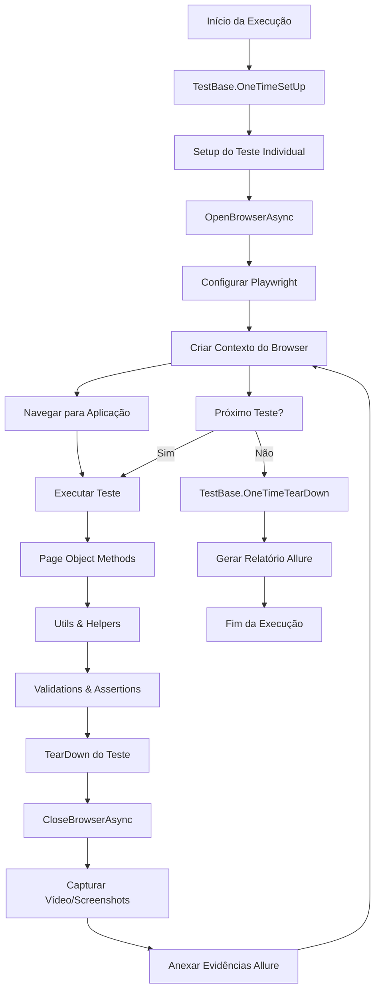

# 🦷 OrtoGreen E2E Testing Framework

[](https://dotnet.microsoft.com/)
[](https://playwright.dev/)
[](https://nunit.org/)
[](https://qameta.io/allure-report/)

Framework de automação de testes End-to-End para a aplicação OrtoGreen, desenvolvido com .NET 8, Playwright e NUnit, com relatórios visuais gerados pelo Allure.

## 📋 Sumário

- [Visão Geral](#-visão-geral)
- [Arquitetura do Projeto](#-arquitetura-do-projeto)
- [Estrutura de Diretórios](#-estrutura-de-diretórios)
- [Fluxo de Execução](#-fluxo-de-execução)
- [Pré-requisitos](#-pré-requisitos)
- [Instalação e Configuração](#-instalação-e-configuração)
- [Execução dos Testes](#-execução-dos-testes)
- [Relatórios Allure](#-relatórios-allure)
- [CI/CD](#cicd)
- [Contribuição](#-contribuição)

## 🎯 Visão Geral

O OrtoGreen E2E é um framework robusto de automação de testes projetado para validar os principais fluxos da aplicação web OrtoGreen. O framework utiliza Page Object Model (POM) para manutenibilidade, Playwright para automação web moderna, e Allure para relatórios detalhados e visuais.


## 🏗️ Arquitetura do Projeto

```
┌─────────────────────────────────────────────────────────────┐
│                    OrtoGreen E2E Framework                  │
├─────────────────────────────────────────────────────────────┤
│  🎭 Test Execution Layer                                    │
│  ┌─────────────┐ ┌─────────────┐ ┌─────────────┐            │
│  │ LoginTests  │ │ PatientTests│ │ DentistTests│            │
│  │ArrivalsTests│ │Availability │ │Speciality   │            │
│  │ScheduleTests│ │   Tests     │ │   Tests     │            │
│  └─────────────┘ └─────────────┘ └─────────────┘            │
├─────────────────────────────────────────────────────────────┤
│  📄 Page Object Layer                                       │
│  ┌─────────────┐ ┌─────────────┐ ┌──────────────┐           │
│  │ LoginPage   │ │PatientsPage │ │DentistsPage  │           │
│  │ArrivalsPage │ │Availability │ │SpecialityPage│           │
│  │SchedulePage │ │   Page      │ │TypeSchedule  │           │
│  └─────────────┘ └─────────────┘ └──────────────┘           │
├─────────────────────────────────────────────────────────────┤
│  🔧 Utility & Support Layer                                 │
│  ┌─────────────┐ ┌─────────────┐ ┌─────────────┐            │
│  │ TestBase    │ │   Utils     │ │Screenshot   │            │
│  │   (Runner)  │ │  (Helpers)  │ │  Helper     │            │
│  │             │ │VideoHelper  │ │VideoUtils   │            │
│  └─────────────┘ └─────────────┘ └─────────────┘            │
├─────────────────────────────────────────────────────────────┤
│  📊 Data & Configuration Layer                              │
│  ┌─────────────┐ ┌─────────────┐ ┌───────────────┐          │
│  │ LoginData   │ │PatientsData │ │GeneralElements│          │
│  │ DentistsData│ │Speciality   │ │Locators       │          │
│  │ ScheduleData│ │   Data      │ │               │          │
│  └─────────────┘ └─────────────┘ └───────────────┘          │
├─────────────────────────────────────────────────────────────┤
│  🌐 Infrastructure Layer                                    │
│  ┌─────────────┐ ┌─────────────┐ ┌─────────────┐            │
│  │ Playwright  │ │   NUnit     │ │   Allure    │            │
│  │   Browser   │ │  Framework  │ │  Reporting  │            │
│  │ Automation  │ │             │ │             │            │
│  └─────────────┘ └─────────────┘ └─────────────┘            │
└─────────────────────────────────────────────────────────────┘
```

## 📁 Estrutura de Diretórios

```
OrtoGreenE2E/
├── 📂 .github/workflows/           # CI/CD Configuration
│   └── 📄 deploy-allure.yml       # GitHub Actions workflow
├── 📂 data/                        # Test Data Objects
│   ├── 📄 ArrivalsData.cs         # Data for arrivals tests
│   ├── 📄 AvailabilityData.cs     # Data for availability tests
│   ├── 📄 DentistsData.cs         # Data for dentists tests
│   ├── 📄 LoginData.cs            # Login credentials data
│   ├── 📄 PatientsData.cs         # Patient test data
│   ├── 📄 SpecialityData.cs       # Speciality test data
│   └── 📄 TypeScheduleData.cs     # Schedule type data
├── 📂 locators/                    # Element Locators
│   └── 📄 GeneralElements.cs       # Common element locators
├── 📂 pages/                       # Page Object Models
│   ├── 📄 ArrivalsPage.cs         # Arrivals page interactions
│   ├── 📄 AvailabilityPage.cs     # Availability page interactions
│   ├── 📄 DentistsPage.cs         # Dentists page interactions
│   ├── 📄 LoginPage.cs            # Login page interactions
│   ├── 📄 PatientsPage.cs         # Patients page interactions
│   ├── 📄 SpecialityPage.cs       # Speciality page interactions
│   └── 📄 TypeSchedulePage.cs     # Schedule page interactions
├── 📂 runner/                      # Test Base Configuration
│   └── 📄 TestBase.cs             # Base test class with setup/teardown
├── 📂 tests/                       # Test Cases
│   ├── 📄 ArrivalsTests.cs        # Arrivals functionality tests
│   ├── 📄 AvailabilityTests.cs    # Availability functionality tests
│   ├── 📄 DentistsTests.cs        # Dentists functionality tests
│   ├── 📄 LoginTests.cs           # Authentication tests
│   ├── 📄 PatientsTests.cs        # Patients functionality tests
│   ├── 📄 SpecialityTests.cs      # Speciality functionality tests
│   └── 📄 TypeScheduleTests.cs    # Schedule functionality tests
├── 📂 utils/                       # Utility Classes
│   ├── 📄 ScreenshotHelper.cs     # Screenshot capture utilities
│   ├── 📄 Utils.cs                # Common utility functions
│   ├── 📄 VideoHelper.cs          # Video recording utilities
│   └── 📄 VideoUtils.cs           # Video processing utilities
├── 📄 .gitignore                   # Git ignore rules
├── 📄 allureconfig.json           # Allure configuration
├── 📄 appsettings.json            # Application configuration
├── 📄 OrtoGreenE2E.csproj         # Project file
└── 📄 OrtoGreenE2E.sln           # Solution file
```

## 🔄 Fluxo de Execução



### Fluxo Detalhado

1. **Inicialização**: `TestBase.OneTimeSetUp()` limpa vídeos antigos
2. **Setup Individual**: Cada teste configura seu próprio browser
3. **Configuração Playwright**: Browser Chromium com viewport 1920x1080
4. **Navegação**: Acesso automático à URL configurada em `appsettings.json`
5. **Execução**: Page Objects executam as interações com a aplicação
6. **Validação**: Assertions e validações dos resultados esperados
7. **Teardown**: Captura de evidências (vídeos, screenshots)
8. **Relatórios**: Geração automática de relatórios Allure

## ⚙️ Pré-requisitos

- **.NET 8.0 SDK** - Runtime e SDK para execução
- **Visual Studio 2022** ou **VS Code** - IDE para desenvolvimento
- **Git** - Controle de versão
- **Node.js 18+** - Para Allure Commandline (opcional, para relatórios locais)

## 🚀 Instalação e Configuração

### 1. Clone o Repositório

```bash
git clone https://github.com/seu-usuario/OrtoGreenE2E.git
cd OrtoGreenE2E
```

### 2. Restaure as Dependências

```bash
dotnet restore
```

### 3. Instale os Browsers Playwright

```bash
dotnet build
pwsh ./bin/Debug/net8.0/playwright.ps1 install --with-deps
```

### 4. Configure as Credenciais

Edite o arquivo `appsettings.json` com as URLs de ambiente:

```json
{
  "Links": {
    "Ortogreen": "https://urboz.com/login"
  }
}
```

### 5. Configure os Dados de Teste

Atualize as classes em `data/` com as credenciais válidas:

```csharp
// Exemplo: LoginData.cs
public class LoginData
{
    public string UserEmail { get; set; } = "seu-email@exemplo.com";
    public string UserPassword { get; set; } = "sua-senha";
}
```

## 🧪 Execução dos Testes

### Executar Todos os Testes

```bash
dotnet test --configuration Debug
```

### Executar Testes Específicos

```bash
# Executar apenas testes de Login
dotnet test --filter "Category=Login"

# Executar testes críticos
dotnet test --filter "Category='Criticality: Critical'"

# Executar em paralelo
dotnet test --configuration Debug --parallel
```

### Executar com Verbosidade Detalhada

```bash
dotnet test --configuration Debug --logger "console;verbosity=detailed"
```

## 📊 Relatórios Allure

### Gerar Relatório Localmente

1. **Instale o Allure Commandline:**

```bash
npm install -g allure-commandline
```

2. **Execute os Testes:**

```bash
dotnet test --configuration Debug
```

3. **Gere o Relatório:**

```bash
allure generate bin/Debug/net8.0/allure-results --clean -o allure-report
allure open allure-report
```

### Recursos do Relatório

- 📈 **Dashboard Interativo** - Visão geral dos resultados
- 🎯 **Suites de Testes** - Organização por funcionalidade
- 📱 **Screenshots** - Evidências visuais dos testes
- 🎥 **Vídeos** - Gravação completa da execução
- 📋 **Timeline** - Linha do tempo de execução
- 🔍 **Logs Detalhados** - Passo a passo das interações

## 🔄 CI/CD

### GitHub Actions Workflow

O projeto utiliza GitHub Actions para automação completa:

```yaml
# .github/workflows/deploy-allure.yml
name: Deploy Allure Report to GitHub Pages

on:
  push:
    branches: [ main ]
  pull_request:
    branches: [ main ]
```

### Processo de CI/CD

1. **Trigger**: Push ou PR para branch `main`
2. **Setup**: Configuração do ambiente .NET 8
3. **Cache**: Cache de pacotes NuGet para otimização
4. **Build**: Compilação do projeto
5. **Install**: Instalação dos browsers Playwright
6. **Test**: Execução completa dos testes
7. **Report**: Geração do relatório Allure
8. **Deploy**: Publicação automática no GitHub Pages

### Acesso aos Relatórios

Os relatórios são automaticamente publicados em:
```
https://seu-usuario.github.io/OrtoGreenE2E/
```

## 🛠️ Tecnologias Utilizadas

| Categoria | Tecnologia | Versão | Descrição |
|-----------|------------|--------|-----------|
| **Runtime** | .NET | 8.0 | Framework principal |
| **Test Framework** | NUnit | 3.14.0 | Framework de testes |
| **Web Automation** | Playwright | 1.55.0 | Automação web moderna |
| **Reporting** | Allure.NET | 2.14.1 | Relatórios visuais |
| **Configuration** | Microsoft.Extensions.Configuration | 9.0.10 | Gerenciamento de configuração |
| **CI/CD** | GitHub Actions | - | Integração e deploy contínuo |

## 📝 Padrões e Boas Práticas

### Page Object Model (POM)
- Separação clara entre lógica de teste e interação com página
- Reutilização de componentes através de classes de página
- Manutenibilidade e escalabilidade do código

### Data-Driven Testing
- Classes de dados separadas para massas de teste
- Configuração externa via `appsettings.json`
- Fácil manutenção de credenciais e dados de teste

### Evidências Completas
- Gravação de vídeo para todos os testes
- Screenshots automáticos em pontos críticos
- Logs detalhados com Allure Steps

### Parallel Execution
- Suporte a execução paralela de testes
- Isolamento adequado entre instâncias de browser
- Otimização do tempo de execução

## 🤝 Contribuição

1. **Fork** o projeto
2. **Crie** uma branch para sua feature (`git checkout -b feature/NovaFuncionalidade`)
3. **Commit** suas mudanças (`git commit -m 'Adicionando nova funcionalidade'`)
4. **Push** para a branch (`git push origin feature/NovaFuncionalidade`)
5. **Abra** um Pull Request

### Diretrizes de Contribuição

- Siga os padrões de código existentes
- Adicione testes para novas funcionalidades
- Documente as mudanças relevantes
- Mantenha a cobertura de testes

## 📞 Suporte

Para dúvidas ou suporte:

- 📧 **Email**: levi@exemplo.com
- 🐛 **Issues**: [GitHub Issues](https://github.com/seu-usuario/OrtoGreenE2E/issues)
- 📖 **Documentação**: [Wiki do Projeto](https://github.com/seu-usuario/OrtoGreenE2E/wiki)

---

**Desenvolvido com ❤️ para garantir a qualidade da aplicação OrtoGreen**